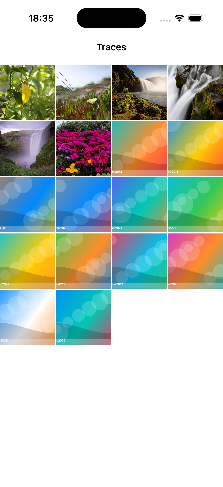

# Traces

<p align="center">
  <strong>A quiet iOS photo browser for seeing places change over time.</strong>
</p>

<p align="center">
  Traces turns a photo library into a timeline of places, seasons, returns, and nearby memories.
  It is built for the moments when "show me what happened here before" is more useful than another endless camera roll.
</p>

<p align="center">
  
  
  
</p>

<p align="center">
  <sub>Library timeline | Photo detail | Related memories</sub>
</p>

## Why

I wanted a way to see places over time through photos.

Photos are usually excellent at recency, albums, and search, but they can make it hard to notice the emotional geography inside a library: the same overlook in different years, a street that keeps reappearing, a trip that rhymes with an older one, or the small visual patterns that only make sense when time and place are allowed to sit together.

Traces exists for that quieter kind of browsing. Pick a photo, then move through the memories around it by date, location, and eventually deeper semantic similarity.

## What it does

- Shows the local photo library as a fast chronological grid.
- Opens photos into a focused detail view with the captured date and time.
- Finds related memories from the same place and from earlier years.
- Builds a local metadata index so related-photo lookup can stay responsive.
- Keeps the retrieval layer ready for semantic/photo-similarity indexing as the app grows.

## Functionality

Traces starts with the library as a timeline. The grid is sorted chronologically, uses PhotoKit-backed thumbnails, and stays close to the camera roll while making time feel more visible.

Opening a photo moves into a quiet detail view. The image gets room to breathe, the capture date and time stay pinned at the top, and the controls stay out of the way until you want to share or explore nearby memories.

The related panel is where Traces begins to become its own thing. It groups candidates into sections such as "Over the years" and "Same place" so a single photo can become a doorway into return visits, older versions of a location, and other moments that happened nearby.

## How it works

Traces is a SwiftUI app backed by PhotoKit and a local GRDB/SQLite index.

PhotoKit remains the source of truth for the user's library. Traces derives a small local index from photo metadata such as dates, dimensions, favorite state, asset kind, and location buckets. SwiftUI receives resolved sections like "Over the years" and "Same place" rather than knowing how those candidates were found.

The goal is to keep the app useful quickly after launch while leaving room for a slower semantic layer, such as Vision feature prints, to plug into the same related-photo flow later.

## Privacy

Traces is designed around the local photo library. Photos are displayed through PhotoKit, and the app stores only its own derived local index in Application Support. There is no server component in this repository.

## Run

Open `Traces.xcodeproj` in Xcode and run the `Traces` scheme on an iOS simulator or device with photo-library access.

For a command-line build:

```sh
xcodebuild -project Traces.xcodeproj -scheme Traces -configuration Debug -destination 'generic/platform=iOS Simulator' -derivedDataPath .build/DerivedData build
```

## Screenshots

Screenshots live in `docs/screenshots/` as full-resolution simulator PNGs and are referenced from this README with relative paths, so they render on GitHub without external image hosting.
